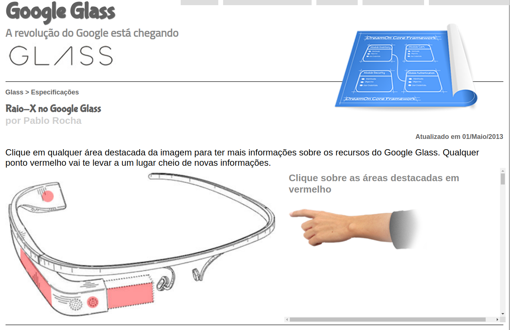
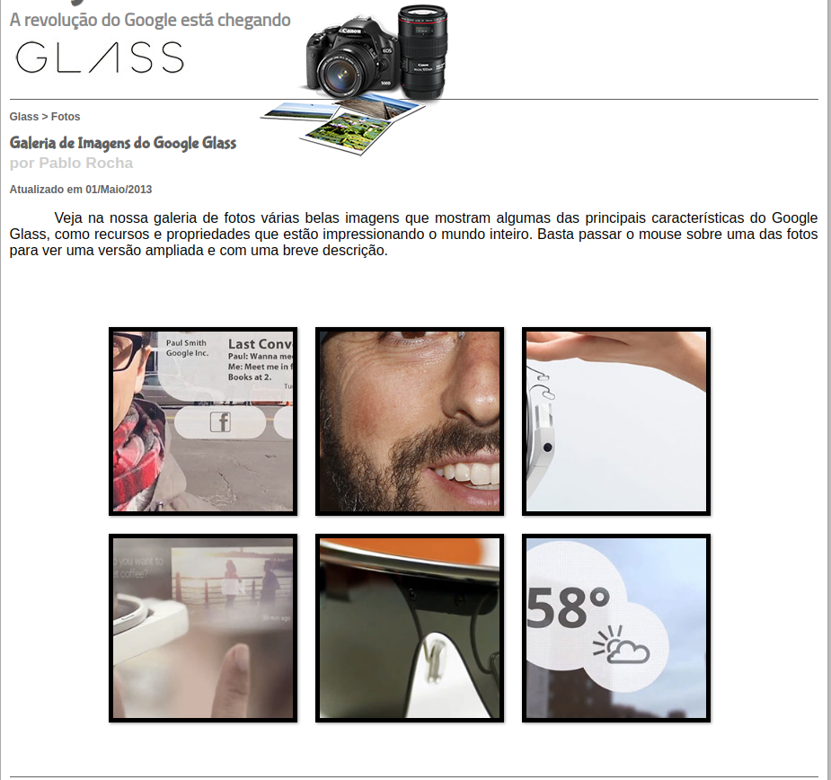
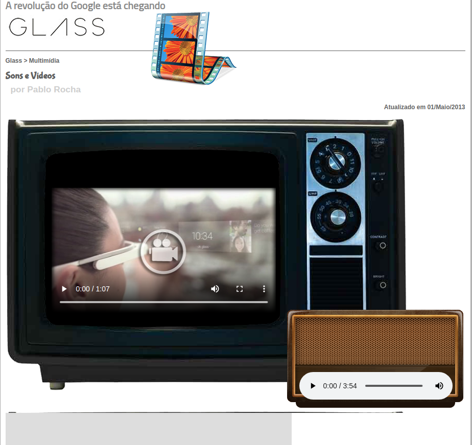
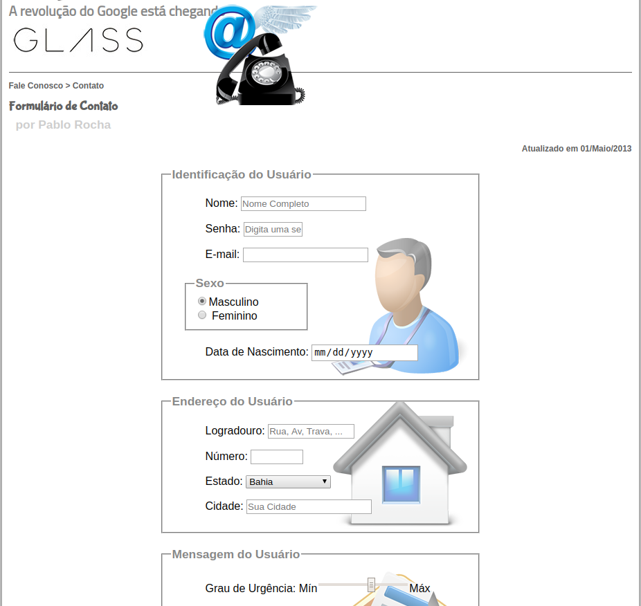

# Web Site Simples feito somente com Css3 e Html5  

### curso ministrado pelo professor Gustavo Guanabara, **aprendendo HTML e CSS**  

<h1 align="center">
    
</h1>

<h1 align="center">
    
</h1>

<h1 align="center">
    
</h1>

<h1 align="center">
    
</h1>

<h1 align="center">
    
</h1>


##### Em breve será hospedado pelo github.io !!!

Just open ```index.html``` to preview
